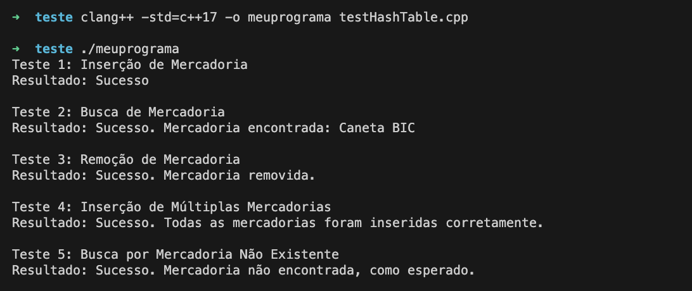

# Hash Table

## Testes da Hash Table de Mercadorias

### Caso de Teste 1: Inserção de Mercadoria
- Descrição: Inserir uma mercadoria na Hash Table.
- Entrada: Mercadoria(codigo=101, nome="Caneta BIC").
- Saída Esperada: Mercadoria inserida com sucesso.

### Caso de Teste 2: Busca de Mercadoria
- Descrição: Buscar uma mercadoria previamente inserida na Hash Table.
- Entrada: codigo=101.
- Saída Esperada: "Caneta BIC".

### Caso de Teste 3: Remoção de Mercadoria
- Descrição: Remover uma mercadoria existente na Hash Table.
- Entrada: codigo=101.
- Saída Esperada: Mercadoria removida com sucesso.

### Caso de Teste 4: Inserção de Múltiplas Mercadorias
- Descrição: Inserir múltiplas mercadorias na Hash Table, algumas com o mesmo hash (para testar o encadeamento).
- Entrada: Mercadorias com códigos 202, 212 (mesmo hash), 305.
- Saída Esperada: Todas as mercadorias inseridas com sucesso, colisões tratadas corretamente.

### Caso de Teste 5: Busca por Mercadoria Não Existente
- Descrição: Buscar por uma mercadoria que não foi inserida.
- Entrada: codigo=999.
- Saída Esperada: "Mercadoria não encontrada".


## Para testar os casos de teste:

1. Ir para a pasta raiz do projeto e executar o comando, para compilar o programa de teste:

    ```
    clang++ -std=c++17 -o meuprograma testHashTable.cpp
    ```

2. Executar o programa de teste:

    ```
    ./meuprograma
    ```

3. Verificar se todos os casos de teste passaram.

4. No final, o resultado esperado é que todos os casos de teste passem, conforme a imagem abaixo:

    


## Os casos de teste e a implementação devem contemplar tratamento de colisões?


Sim, no código da classe `HashTable`, as colisões são tratadas usando uma técnica de encadeamento, onde cada slot da tabela hash contém uma lista ligada de mercadorias que foram mapeadas para aquele slot. 

Quando ocorre uma colisão durante a inserção de uma mercadoria na tabela hash (ou seja, duas ou mais mercadorias são mapeadas para o mesmo índice após a aplicação da função de hash), a mercadoria é adicionada ao final da lista ligada no slot correspondente, em vez de substituir a mercadoria já presente. 

Em outras palavras, isso garante que todas as mercadorias com a mesma chave de hash possam ser armazenadas e recuperadas corretamente.

Além disso, os casos de teste incluem a inserção de várias mercadorias com chaves de hash que colidem entre si, garantindo que o tratamento de colisões esteja funcionando corretamente.

Portanto, tanto a implementação quanto os casos de teste atendem ao requisito de contemplar o tratamento de colisões na tabela hash.